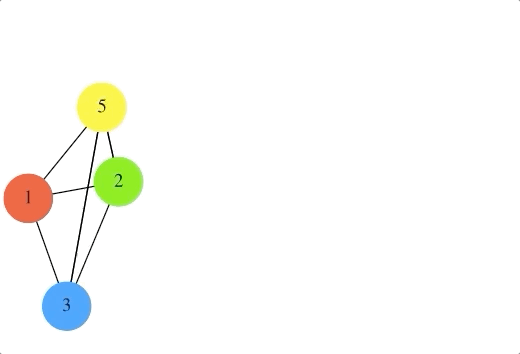
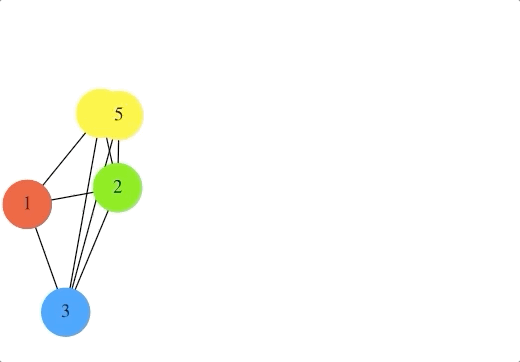

# Graph Animation Project

## Descriptions
This project is inspired by https://www.cs.usfca.edu/~galles/visualization/Algorithms.html.

My script will create many individual GIF images based on a text file describing nodes, edges, and their attributes, then they will be combined into a single animated GIF.

## How to run 
Python3 anime.py duplications.txt (linear|logarithmic) anime.gif

anime.py -- python script   
duplications.txt -- text file describing nodes, edges, and their attributes  
linear|logarithmic -- select either linear or logarithmic to specify how you want nodes will be moved   
anim.gif -- name of the newly created gif  

Also, you need to create a directory named "gifdir" to store many individual GIF images

## Expected Result
ex)anime.gif

Linear version 

Logarithmic version

## Technologies
- pyGraphviz
- gifsicle

